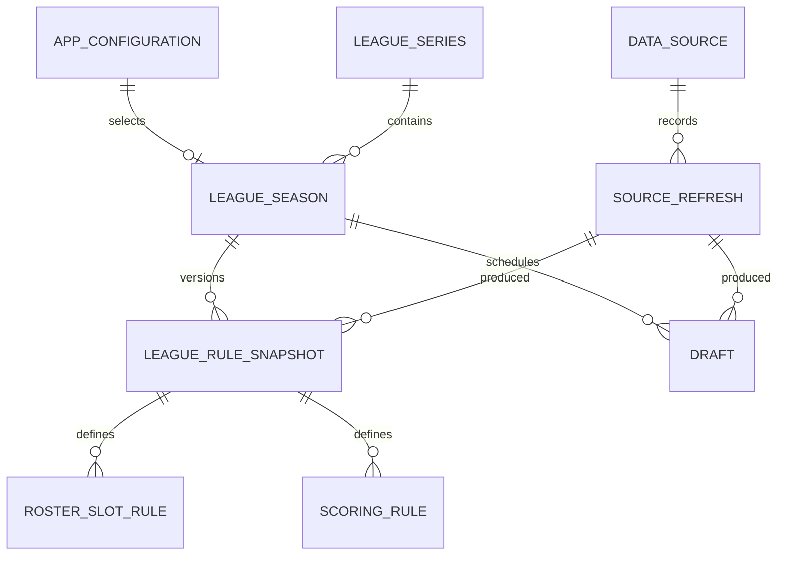
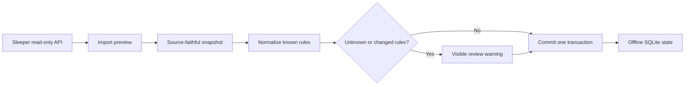

# ADR-002: Local Data and Configuration Model

**Status:** Accepted

**Date:** 2026-07-24

**Deciders:** Pierce Trahan and Codex

## Context

The Hub must understand Entropy's exact league rules while remaining flexible
enough to represent other dynasty and redraft formats. It must work offline,
survive restarts, explain which settings affected a recommendation, and retain
the original source data when a provider rule is unfamiliar.

The public repository must never contain real account IDs, league IDs, member
identities, rosters, or chat. Real imported data belongs only in the local
application data directory.

## Decision

SQLite will hold authoritative application state. The application will use:

- SQLAlchemy 2.x for explicit database access;
- Alembic for ordered, reviewable schema migrations;
- Pydantic models for API and configuration validation;
- UUID strings for stable internal identifiers;
- UTC ISO 8601 timestamps for stored times; and
- IANA timezone names, such as `America/Chicago`, for display preferences.

The database will preserve both:

1. a source-faithful snapshot of imported provider data; and
2. normalized records used by Hub features.

This is similar to keeping both raw game film and the scouting report made from
it. The report is easier to use, but the film remains available when a judgment
or translation needs to be audited.

## Local Storage Layout

Production data will live outside the repository and outside OneDrive:

```text
%LOCALAPPDATA%\FriendlyNeighborhoodFantasyHub\
|-- hub.sqlite3
|-- backups\
|-- exports\
|-- logs\
|-- cache\
`-- recovery\
```

Development and automated tests may override the data directory through an
explicit development setting. Production startup will not depend on the
current working directory.

## Core Data Model



### `app_configuration`

One logical configuration document validated against
`docs/schemas/app-config.schema.json`.

It contains only user-level application preferences and references:

- active league-season;
- display timezone and theme;
- automatic-backup policy; and
- confirmation behavior for destructive actions.

Feature state, league rules, and secrets do not belong in application
configuration.

### `league_series`

A stable local concept representing one continuing league across seasons.

Important fields:

- internal `id`;
- display name;
- sport; and
- created and updated timestamps.

A provider's yearly league ID is not the primary key. Sleeper may create a new
league identifier when a league rolls into another season.

### `league_season`

One season of a league.

Important fields:

- internal `id`;
- `league_series_id`;
- season;
- league type: dynasty, keeper, redraft, or unknown;
- status;
- team count;
- provider name;
- provider league identifier, stored locally;
- active rule-snapshot reference; and
- import timestamps.

The provider identifier is sensitive local data. It must be removed from
sanitized exports, fixtures, and normal diagnostic logs.

### `league_rule_snapshot`

An immutable, versioned set of league rules.

Important fields:

- internal `id`;
- `league_season_id`;
- monotonically increasing version;
- source-refresh reference;
- source payload JSON;
- normalized content hash;
- effective and imported timestamps; and
- translation status: complete, partial, or review-required.

Re-importing identical rules does not create a new active version. A changed
rule set creates a new snapshot rather than rewriting the old one. Drafts,
reports, and recommendations can therefore explain which rules they used.

### `roster_slot_rule`

An ordered row for each lineup or roster slot.

Important fields:

- rule-snapshot reference;
- zero-based display order;
- normalized slot type, such as `QB`, `FLEX`, or `SUPER_FLEX`;
- slot group: starter, bench, taxi, or injured reserve;
- eligible positions when the slot is flexible; and
- provider key and original value.

Repeated rows are intentional. Three flex positions are stored as three
ordered rules, not as a single boolean.

### `scoring_rule`

One normalized scoring instruction.

Important fields:

- rule-snapshot reference;
- provider key;
- normalized statistic key;
- rule kind: multiplier, fixed, threshold, bracket, or bonus;
- points;
- unit or threshold parameters as JSON;
- optional position scope;
- original provider value; and
- translation status.

For example, Entropy's `bonus_fd_te` rule becomes a receiving-first-down bonus
scoped to tight ends. It does not become generic tight-end PPR.

### `draft`

A draft belongs to a league-season, not directly to the continuing league.

Important fields:

- internal `id`;
- `league_season_id`;
- provider draft identifier, stored locally;
- purpose: startup, rookie, supplemental, or unknown;
- format: snake, linear, auction, or unknown;
- status;
- team count;
- number of rounds;
- pick timer;
- reversal round;
- scheduled start time; and
- imported timestamps.

Multiple drafts may belong to one league-season. Draft order, picks, and live
state will be added in Phase 3 without changing this ownership model.

### `data_source`

The registry of permitted input sources.

Important fields:

- stable source key;
- display name;
- source category;
- official URL and terms URL;
- attribution text;
- enabled status; and
- notes about permitted use.

### `source_refresh`

One attempted data refresh.

Important fields:

- source reference;
- refresh type;
- started and completed timestamps;
- source `as_of` timestamp when available;
- status: running, succeeded, partial, or failed;
- record counts;
- content hash;
- non-sensitive error code; and
- user-facing summary.

Failures remain visible. The application never presents old source data as
fresh simply because a refresh failed.

## Source Import Flow



The React frontend will not call Sleeper directly. The FastAPI backend owns
network access, validation, normalization, transactions, and refresh history.

The initial API boundary will be:

- `GET /api/v1/config`
- `PUT /api/v1/config`
- `GET /api/v1/league-seasons`
- `GET /api/v1/league-seasons/{id}`
- `POST /api/v1/imports/sleeper/preview`
- `POST /api/v1/imports/sleeper/commit`
- `GET /api/v1/source-refreshes`

Preview and commit are separate so the user can see changes before replacing
the active configuration.

## SQLite Reliability Conventions

Every production connection will enable:

- foreign-key enforcement;
- write-ahead logging;
- a bounded busy timeout; and
- explicit transactions for every multi-record state change.

Migrations run before the local server accepts requests. A failed migration
leaves the previous database and a recovery copy intact and produces a
plain-language error.

Database files must never be copied directly while a write may be active.
Backups use SQLite's backup API to create a consistent snapshot.

## Backup and Export Format

Automatic backups are private recovery artifacts:

```text
friendly-hub-backup-v1-YYYYMMDD-HHMMSS.zip
|-- manifest.json
|-- hub.sqlite3
`-- checksums.json
```

The manifest records:

- backup format version;
- application version;
- database schema version;
- creation timestamp;
- source device label, if the user supplies one; and
- whether the archive contains personal data.

Backups are written to a temporary filename, verified, and then renamed
atomically. The default retention is 10 successful backups.

Feature exports are separate, human-readable artifacts. A board or draft-state
export must not be confused with a full private backup.

## Privacy and Logging Boundary

- Sleeper authentication credentials are neither needed nor stored.
- Account, league, draft, and member identifiers remain local.
- League chat is never imported.
- Normal logs use internal correlation IDs rather than provider IDs.
- Diagnostic exports require an explicit preview of included files.
- Public fixtures use fake identifiers and deliberately sanitized names.

## Trade-offs

### Versioned rule snapshots

This creates more tables and import logic than editing league settings in
place. It is accepted because old mocks and recommendations must remain
explainable after league rules change.

### Raw payload plus normalized records

This uses additional disk space. Local league settings are small, and the
auditability is worth far more than the storage cost.

### UUID string identifiers

They use more space than SQLite integers. They make backup, export, fixture,
and cross-table references stable without exposing provider identifiers.

### SQLAlchemy and Alembic

They add dependencies and concepts to learn. They provide explicit migrations
and predictable database behavior, which are important for a local application
that must preserve years of personal work.

## Revisit Later

- Field-level provenance when Phase 4 combines several market sources.
- Encryption at rest if the threat model expands beyond a personal computer.
- DuckDB if historical analysis becomes too cumbersome in SQLite.
- Hosted synchronization only if multi-device use becomes a real requirement.

## Consequences and Next Actions

1. Implement the repository/module skeleton around this ownership model.
2. Create the initial Alembic migration for the Phase 0 tables.
3. Validate the sanitized Entropy fixture against the canonical schema.
4. Implement configuration persistence and restart verification.
5. Implement SQLite backup and restore verification.
6. Define logging and user-facing error conventions before live imports.
