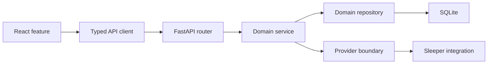

# ADR-003: Repository and Module Structure

**Status:** Accepted

**Date:** 2026-07-24

**Deciders:** Pierce Trahan and Codex

## Context

The Hub has a React frontend, a FastAPI backend, SQLite persistence, external
data integrations, and several fantasy-football domains that will grow over
multiple phases. Google AI Studio will contribute bounded frontend prototypes,
while Codex will own backend integration, audits, and production reliability.

The repository needs visible ownership boundaries before the first application
skeleton is generated. Those boundaries must be understandable to a new
developer and should not require microservices, multiple deployments, or
framework-heavy abstractions.

## Decision

The Hub will be a modular monolith in one repository:

- one React application;
- one FastAPI application;
- one SQLite database;
- one local production process; and
- feature-oriented modules with explicit dependency direction.

This resembles a football front office. Scouting, coaching, and operations are
part of one organization, but each department owns its work and uses agreed
handoffs rather than editing everyone else's files.

## Repository Layout

```text
The-Friendly-Neighborhood-Fantasy-HUB/
|-- frontend/
|   |-- package.json
|   |-- vite.config.ts
|   |-- tsconfig.json
|   |-- src/
|   |   |-- app/
|   |   |-- api/
|   |   |-- features/
|   |   |-- shared/
|   |   |-- styles/
|   |   `-- main.tsx
|   `-- tests/
|-- backend/
|   |-- pyproject.toml
|   |-- alembic.ini
|   |-- migrations/
|   |-- src/
|   |   `-- friendly_hub/
|   |       |-- api/
|   |       |-- core/
|   |       |-- db/
|   |       |-- domains/
|   |       |-- integrations/
|   |       `-- main.py
|   `-- tests/
|-- contracts/
|   `-- openapi.json
|-- docs/
|-- scripts/
|-- tests/
|   `-- fixtures/
|-- AGENTS.md
|-- CONTRIBUTING.md
`-- README.md
```

The root remains documentation and orchestration space. JavaScript dependencies
stay inside `frontend/`; Python application dependencies stay inside
`backend/`.

## Frontend Ownership

### `frontend/src/app`

Application composition only:

- router;
- providers;
- global error boundary;
- page shell;
- startup and health checks; and
- top-level navigation.

It does not contain fantasy calculations or reusable feature internals.

### `frontend/src/api`

The single gateway to the FastAPI application:

- generated API types;
- HTTP client configuration;
- error-envelope translation;
- request cancellation; and
- development mock adapters.

React components do not call `fetch` directly.

### `frontend/src/features`

Feature folders follow the product roadmap:

```text
features/
|-- settings/
|-- league-setup/
|-- players/
|-- boards/
|-- gut-elo/
|-- draft-room/
|-- mocks/
|-- alerts/
`-- reports/
```

Each feature may contain its own components, hooks, state, tests, and public
entrypoint. One feature must not import another feature's internal files.

### `frontend/src/shared`

Small, product-neutral building blocks:

- accessible UI primitives;
- formatting helpers;
- generic table and dialog behavior;
- shared hooks; and
- stable types not owned by one feature.

Code is promoted to `shared` only after it has a real second consumer. This
prevents a premature component library from becoming its own project.

### `frontend/src/styles`

Design tokens and global styles. AI Studio prototypes should use the same tokens
instead of hard-coding a second visual system.

## Backend Ownership

### `backend/src/friendly_hub/api`

HTTP transport concerns:

- versioned routers;
- request and response mapping;
- dependency wiring;
- API error envelopes; and
- OpenAPI generation.

Routers remain thin. They validate transport input, call one application
service, and translate the result.

### `backend/src/friendly_hub/core`

Cross-cutting application infrastructure:

- runtime paths;
- application configuration;
- clock and identifier helpers;
- logging setup;
- error base classes; and
- startup and shutdown behavior.

Fantasy-football rules do not belong in `core`.

### `backend/src/friendly_hub/db`

Database-wide infrastructure:

- SQLAlchemy registry and session management;
- SQLite connection settings;
- migration startup checks;
- transaction helpers;
- backup and restore services; and
- database health checks.

Domain-specific queries do not accumulate here.

### `backend/src/friendly_hub/domains`

Feature-oriented backend modules:

```text
domains/
|-- configuration/
|-- leagues/
|-- sources/
|-- players/
|-- boards/
|-- comparisons/
|-- drafts/
|-- mocks/
|-- alerts/
`-- reports/
```

A mature domain module may contain:

```text
drafts/
|-- models.py
|-- schemas.py
|-- repository.py
|-- service.py
|-- router.py
`-- tests/
```

Small modules may begin with fewer files. Files are split when they represent
different responsibilities, not to satisfy a target folder count.

### `backend/src/friendly_hub/integrations`

Provider-specific network and translation code:

```text
integrations/
`-- sleeper/
    |-- client.py
    |-- schemas.py
    |-- mapper.py
    `-- errors.py
```

Sleeper field names end at this boundary. Domain services receive canonical Hub
models rather than raw provider dictionaries.

## Dependency Direction



The rules are:

1. The frontend never imports backend code or accesses SQLite.
2. React components never call external providers directly.
3. API routers contain no business rules.
4. Domain services own use cases and transaction boundaries.
5. Repositories own domain-specific database queries.
6. Integrations translate provider data but do not decide fantasy strategy.
7. Lower-level modules never import the API or React layers.
8. Cross-domain work goes through a service's public interface.

Interfaces or protocols are introduced at provider, clock, and storage
boundaries where tests genuinely need substitution. The project will not wrap
every class in an interface by default.

## API Contract

FastAPI's OpenAPI document is the contract source. A checked-in
`contracts/openapi.json` snapshot makes API changes reviewable. Frontend API
types are generated from that contract rather than manually duplicated.

During development, Vite proxies `/api` to FastAPI. In production, FastAPI
serves the compiled frontend and the API from the same local origin.

Contract changes follow this order:

1. update backend request and response models;
2. regenerate and review `contracts/openapi.json`;
3. regenerate frontend API types;
4. update the consuming feature; and
5. run backend, frontend, and contract checks.

## Testing Layout

- Backend unit tests live beside or under their domain's backend tests.
- Backend integration tests use a temporary SQLite database.
- Frontend component tests live with the feature they exercise.
- Shared sanitized fixtures live under root `tests/fixtures`.
- End-to-end tests launch the real local application with temporary data.
- Tests never read or write the production `%LOCALAPPDATA%` directory.

The first launch proof will test:

- local startup;
- health response;
- configuration write;
- process restart;
- configuration read; and
- offline loading of the sanitized Entropy fixture.

## Scripts and Launching

Root `scripts/` will expose the few commands a non-technical user or
contributor needs:

- `bootstrap.ps1` installs development dependencies;
- `dev.ps1` starts the frontend and backend development servers;
- `verify.ps1` runs all available checks; and
- `run.ps1` starts the production-shaped local application.

A friendly `.cmd` launcher may wrap `run.ps1` so normal use does not require
remembering a terminal command.

## AI Studio Boundary

AI Studio work is normally limited to:

- `frontend/src/features/<agreed-feature>`;
- explicitly shared UI primitives;
- design tokens;
- frontend tests for the scoped interaction; and
- a preview-only mock adapter when the real endpoint does not exist yet.

AI Studio must not independently:

- change backend domain models;
- invent a second API contract;
- replace generated API types;
- add cloud persistence;
- store authoritative state in browser storage; or
- edit migration and recovery behavior.

## Trade-offs

### Modular monolith

This provides less deployment independence than microservices. V1 needs one
reliable personal application, so separate services would add failure modes
without adding meaningful value.

### Feature-oriented folders

Some shared concepts will require careful placement. The alternative—a large
layer folder for all components, all services, or all models—would make feature
ownership harder to see as the project grows.

### Generated frontend API types

Generation adds a build step. It prevents subtle drift between TypeScript and
Python definitions, which is more valuable than the small workflow cost.

### Separate frontend and backend dependency roots

There are two toolchains. Keeping their dependencies isolated makes auditing,
upgrading, and eventual packaging more predictable.

## Revisit Later

- Extract a reusable UI package only if another real application consumes it.
- Split a backend service only if deployment or workload evidence requires it.
- Add a task queue only when a measured operation cannot complete safely in a
  request or controlled background job.
- Reconsider the root script format during desktop packaging.

## Consequences and Next Actions

1. Scaffold only the Phase 0 folders and launch path.
2. Add the smallest configuration and health modules.
3. Generate the first OpenAPI contract and TypeScript types.
4. Prove persistence, restart, and offline fixture loading.
5. Keep later roadmap feature folders empty until their scoped phase begins.
