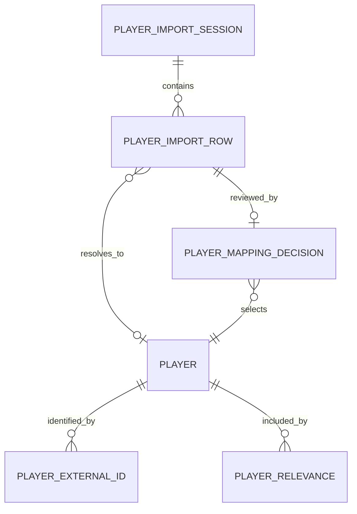

# Phase 1 Specification: Player Universe and Identity Normalization

**Status:** Approved for implementation

**Date:** 2026-07-24

## Outcome

Phase 1 creates one trustworthy internal identity for every relevant football
player. Later rankings, tiers, comparisons, draft picks, alerts, and reports
must reference that internal identity instead of a provider-specific ID or a
player name.

This is the scouting department's master player file. Sleeper, a CSV, and a
future market source may each use a different label or ID, but the Hub keeps
one canonical player card and records how every source maps to it.

## Scope

### Included

- canonical player records with UUID identifiers;
- external-ID mappings, beginning with Sleeper;
- normalized display and search names;
- suffix, team, fantasy positions, status, and rookie-class normalization;
- source-faithful import rows and import timestamps;
- preview-before-commit imports;
- explicit new, matched, changed, ambiguous, and invalid outcomes;
- manual correction and persistent mapping support;
- search and filters for active status, position, rookie class, and relevance;
- CSV import and human-readable CSV export;
- a sanitized offline player fixture; and
- a reconciliation screen for import review.

### Excluded

- rankings, tiers, notes, favorites, and Gut ELO;
- ADP, projections, market values, or recommendations;
- draft state and roster optimization;
- automated fuzzy-match acceptance;
- league chat or unrelated Sleeper account data; and
- browser storage as an authoritative database.

## Functional Requirements

1. A canonical player receives an internal UUID that never changes because a
   provider changes its identifier, team, status, or display name.
2. A `(provider, external_id)` pair maps to at most one canonical player.
3. Repeat import of the same source record is idempotent and does not create a
   duplicate player or mapping.
4. Exact external-ID mappings may update non-identity fields after preview.
5. A normalized name and compatible position may propose a match but must not
   silently commit it.
6. Multiple possible matches always enter the review queue.
7. Manual choices persist as mapping decisions and win on later imports unless
   the user explicitly changes them.
8. Invalid rows stay visible with a safe explanation; valid rows in the same
   preview remain usable.
9. The raw source payload remains local and is never included in normal logs.
10. Every committed change records source, import time, and the import session.
11. Player list and export use canonical internal IDs.
12. A user can filter inactive or irrelevant players without deleting them.

## Relevant Player Pool

A player is relevant when at least one reason applies:

- currently rostered in the selected league;
- inside a configured market-relevance cutoff;
- part of the current rookie class and likely draft/taxi eligible;
- manually included by the user; or
- referenced by a saved board or draft.

Phase 1 initially supports `sanitized_fixture`, `csv`, and `manual` relevance
reasons. Sleeper roster relevance and market cutoffs may be added without
changing the canonical player identity.

## Canonical Data Model

### `player`

- `id`: UUID string, primary key;
- `display_name`: normalized human-readable name;
- `first_name`, `last_name`, `suffix`: nullable normalized components;
- `search_name`: case-folded, punctuation-insensitive lookup value;
- `team`: nullable normalized NFL abbreviation;
- `primary_position`: `QB`, `RB`, `WR`, `TE`, `K`, `DEF`, or `UNKNOWN`;
- `fantasy_positions_json`: ordered distinct position list;
- `status`: `active`, `inactive`, `injured`, `reserve`, or `unknown`;
- `rookie_class`: nullable four-digit year;
- `is_rookie`: boolean;
- `created_at` and `updated_at`: UTC timestamps.

Names are editable presentation data, not identity keys.

### `player_external_id`

- `id`: UUID string, primary key;
- `player_id`: canonical player reference;
- `provider`: lowercase stable source key;
- `external_id`: provider identifier stored locally;
- `is_manual_override`: whether a user explicitly confirmed the mapping;
- `first_seen_at` and `last_seen_at`: UTC timestamps; and
- unique constraint on `(provider, external_id)`.

Provider IDs are excluded from normal logs and sanitized exports.

### `player_relevance`

- `id`: UUID string, primary key;
- `player_id`: canonical player reference;
- `reason`: `sanitized_fixture`, `league_roster`, `market_cutoff`,
  `rookie_pool`, `manual`, `saved_board`, or `saved_draft`;
- `reference_id`: nullable internal reference;
- `active`: boolean; and
- `created_at` and `updated_at`: UTC timestamps.

### `player_import_session`

- `id`: UUID string, primary key;
- `source`: `sanitized_fixture`, `csv`, `sleeper`, or `manual`;
- `status`: `preview`, `committed`, `cancelled`, or `failed`;
- `filename`: nullable display-only filename;
- aggregate counts for every outcome;
- `created_at` and nullable `committed_at`; and
- non-sensitive content hash used for repeat-import detection.

### `player_import_row`

- `id`: UUID string, primary key;
- `session_id` and one-based `row_number`;
- source-faithful payload JSON;
- normalized candidate JSON;
- outcome: `new`, `matched`, `changed`, `ambiguous`, `invalid`, or `ignored`;
- nullable proposed or resolved canonical player ID;
- candidate canonical IDs for ambiguous rows;
- safe reason code and user-facing explanation; and
- unique constraint on `(session_id, row_number)`.

### `player_mapping_decision`

- `id`: UUID string, primary key;
- `import_row_id`;
- selected canonical `player_id`;
- decision: `match_existing`, `create_new`, or `ignore`;
- `created_at`; and
- optional short user note.

## Name Normalization

Normalization is deterministic and used for searching and candidate generation:

1. trim surrounding whitespace;
2. normalize Unicode;
3. case-fold;
4. standardize periods/apostrophes and collapse repeated whitespace;
5. separate recognized suffixes such as `Jr`, `Sr`, `II`, `III`, and `IV`;
6. preserve the human-facing display spelling; and
7. never remove meaningful name parts to force a match.

Name similarity can create review candidates. It cannot prove identity.

## Matching Order

Each import row is evaluated in this order:

1. **Exact persisted external ID:** safe automatic match.
2. **Persisted manual mapping:** safe automatic match.
3. **Exact normalized name plus one compatible position:** proposed match that
   requires confirmation for a new source mapping.
4. **Several possible players:** ambiguous; requires review.
5. **No candidate and valid required fields:** proposed new player.
6. **Missing or invalid required fields:** invalid; cannot commit.

Team changes never create a new identity. Position changes appear in preview
as field changes. A reused provider ID is a blocking conflict.

## CSV Contract

UTF-8 CSV is accepted with a header row.

Required columns:

- `name`
- `position`

Supported optional columns:

- `external_id`
- `provider`
- `team`
- `status`
- `rookie_class`
- `is_rookie`
- `include`

Unknown columns are preserved in the source payload and reported in the preview.
They are not silently promoted into the canonical model.

## API Contract

### Player queries

- `GET /api/v1/players`
  - filters: `search`, `position`, `status`, `rookie_class`, `relevant_only`;
  - pagination: `limit` and `offset`;
  - returns canonical records and total count.
- `GET /api/v1/players/{player_id}`
- `PATCH /api/v1/players/{player_id}`
  - manual corrections to presentation and normalized fields;
  - never edits external IDs implicitly.
- `GET /api/v1/players/export.csv`

### Import workflow

- `POST /api/v1/player-imports/fixture/preview`
- `POST /api/v1/player-imports/csv/preview`
- `GET /api/v1/player-imports/{session_id}`
- `PUT /api/v1/player-imports/{session_id}/rows/{row_id}/decision`
- `POST /api/v1/player-imports/{session_id}/commit`
- `POST /api/v1/player-imports/{session_id}/cancel`

Preview creates a persisted review session but does not change canonical player
records. Commit is one database transaction and fails if any unresolved
ambiguous or invalid row is still marked for inclusion.

All state-changing requests use the existing local request guard.

## Reconciliation Screen

The initial player feature has three views:

1. **Player Universe:** searchable/filterable canonical player table.
2. **Import Preview:** summary counts and rows grouped by outcome.
3. **Needs Review:** focused ambiguous/invalid queue with candidate comparison,
   create-new, match-existing, ignore, and undo controls.

The screen must:

- show source and freshness;
- explain why a row needs review;
- keep provider IDs visually secondary;
- never label a fuzzy suggestion as confirmed;
- support keyboard navigation for the review queue;
- provide a final commit summary; and
- avoid rankings, ADP, or draft recommendations.

## Privacy and Logging

- Never commit real provider IDs or player-roster associations to the repository.
- Public fixtures use fictional provider IDs and only publicly known player
  names or entirely fictional players.
- Raw import rows stay in the local database.
- Logs may include session ID, row count, outcome counts, duration, and safe
  error codes.
- Logs must not include filenames containing personal names, provider IDs, raw
  CSV rows, or full source payloads.

## Non-Functional Requirements

- A 10,000-row import preview should complete without freezing the interface.
- Player queries are paginated and indexed for search/filter fields.
- The sanitized fixture works without network access.
- Repeated import and commit operations are idempotent.
- A failed commit leaves canonical player tables unchanged.
- Schema changes use Alembic and remain forward-only.

## Acceptance Tests

1. Importing the sanitized fixture creates one canonical row per fixture player.
2. Importing that fixture again creates no duplicate players or mappings.
3. An exact provider-ID row matches its existing canonical player.
4. A same-name, same-position row without a known provider ID requires review.
5. Two same-name candidates are never silently matched.
6. A manual match persists and resolves the same external ID on a later import.
7. An invalid row remains visible and blocks commit while included.
8. Ignoring an invalid row allows the remaining valid rows to commit.
9. A failed multi-row commit creates or updates no canonical player.
10. Search is punctuation- and case-insensitive.
11. Position, status, rookie-class, and relevance filters work together.
12. CSV export can be read back without losing canonical internal IDs.
13. Logs and API errors do not echo raw import content or provider IDs.
14. The reconciliation screen labels suggested matches as unconfirmed.
15. The full workflow works from the sanitized fixture with the network off.

## AI Studio Implementation Boundary

AI Studio may implement only:

- `frontend/src/features/players/**`;
- narrowly required additions to `frontend/src/api/client.ts`;
- additions to existing design tokens or global navigation;
- frontend tests for the player universe and reconciliation workflow; and
- a clearly labeled preview mock that follows the checked-in OpenAPI contract.

AI Studio must not:

- modify backend code, migrations, generated API types, or OpenAPI;
- add cloud storage, authentication, or direct Sleeper calls;
- use browser storage as authoritative state;
- introduce rankings, ADP, Gut ELO, draft-room, or recommendation features; or
- replace the existing application shell or visual language.

## Trade-offs and Later Revisit

- Persisting import previews adds tables but makes review resumable and
  auditable.
- Conservative matching creates more manual review but prevents identity errors
  from poisoning every later feature.
- JSON preserves source rows cheaply for V1; field-level provenance can be
  revisited when multiple market sources are combined.
- SQLite and synchronous request processing are sufficient for local V1.
  Background workers should be reconsidered only if measured import time harms
  the interface.
