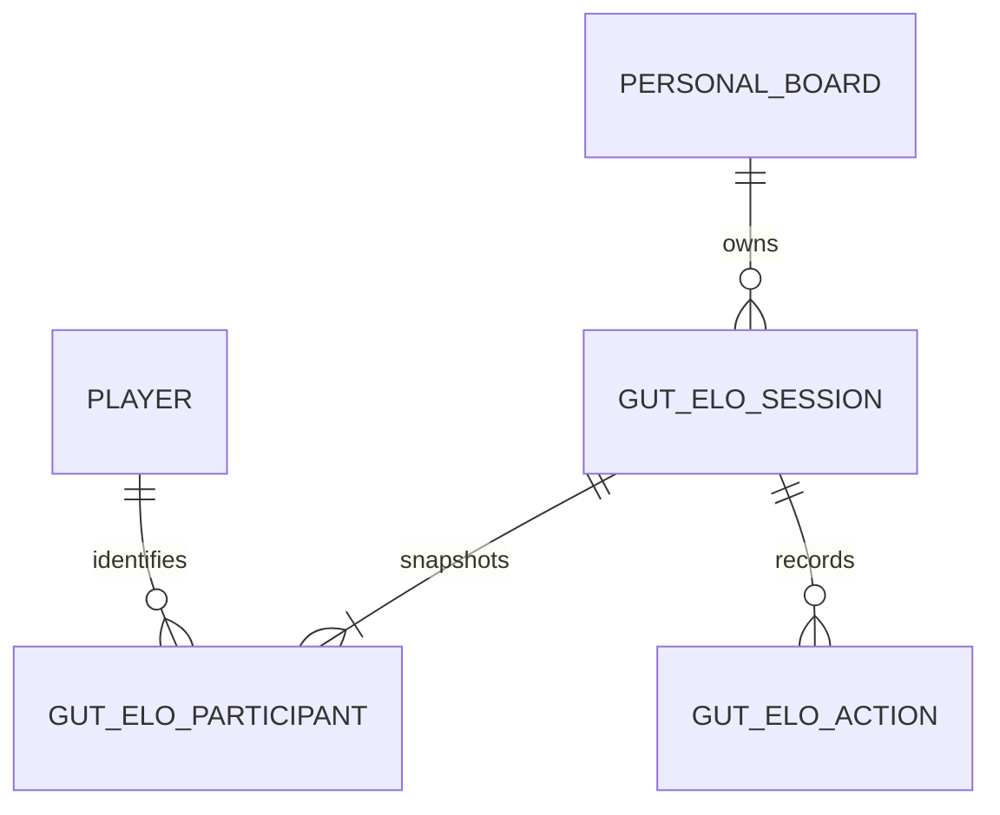

# Phase 2B Specification: Gut ELO Comparisons

**Status:** Approved for implementation

**Date:** 2026-07-26

## Outcome

Phase 2B adds a bounded pairwise-comparison workspace that helps the user
surface instinctive player preferences without pretending those preferences
are objective truth.

Gut ELO is an assistant to the Personal Board. It produces a separate,
explainable signal and never changes manual rank, tier, note, or favorite data.

## Scope

### Included

- resumable comparison sessions tied to one Personal Board;
- participant snapshots using canonical player IDs;
- queues for the full board, one position, one tier, or uncertainty review;
- decisive left/right choices;
- skip and not-enough-information controls;
- reversible undo;
- deterministic ELO calculation and pair selection;
- bounded comparison targets;
- progress, coverage, and stability labels;
- separate overall, rookie, and veteran workflows through board scope;
- a result table that compares Gut ELO order with starting manual order; and
- local transactional persistence.

### Excluded

- automatic Personal Board reordering;
- player-quality claims, projections, ADP, or market values;
- cross-user or cloud comparison data;
- machine-learned pair selection;
- forced comparisons against players outside the selected board;
- draft-state availability;
- importing provider IDs into comparison responses; and
- using Gut ELO as a recommendation or pick-selection engine.

## Product Rules

1. Manual Personal Board order remains authoritative.
2. A session snapshots active board participants when it starts. Later board
   edits do not silently change that session.
3. Every participant is identified by the canonical internal player ID.
4. The same session input and ordered action history produce the same ratings,
   ordering, next pair, progress, and labels.
5. A decisive comparison changes ratings. Skip and not-enough-information do
   not.
6. Not-enough-information resolves the current pair for that session. Skip
   postpones it and allows it to return after other candidates.
7. Undo reverses the latest active action, including skip, by marking it undone
   and replaying the remaining action history.
8. The client must submit the exact currently offered pair and revision.
   Stale or double submissions are rejected without changing the session.
9. Comparison targets are bounded. The user is never required to compare every
   possible pair or the entire player universe.
10. Progress and stability labels describe the session evidence only. They do
    not claim that a ranking is correct or statistically proven.
11. Rookie and veteran workflows use boards with the matching scope rather
    than mixing hidden participant rules into one session.
12. Archived boards cannot start new sessions, but existing sessions and their
    results remain readable.

## Terminology

- **Manual rank:** the participant's rank on the Personal Board when the
  session starts.
- **Gut rating:** the session-local ELO rating calculated from decisive
  actions.
- **Resolved pair:** a pair with a decisive or not-enough-information outcome.
- **Postponed pair:** a pair whose latest active action is skip.
- **Revision:** the count of active actions. It guards against stale submits.
- **Target:** the bounded number of resolved comparisons that marks the
  session useful enough to complete.
- **Coverage:** how broadly decisive comparisons have involved participants.
- **Stability:** whether recent decisive actions are still moving the displayed
  order substantially.

## Queue Modes

### `board`

Includes every active entry in the selected Personal Board snapshot. Pair
selection prioritizes balanced participant coverage, then adjacent starting
manual ranks.

### `position`

Includes active board entries whose canonical primary position matches the
selected position. At least two eligible participants are required.

### `tier`

Includes active board entries assigned to the selected board tier. The tier
must belong to the selected board and contain at least two eligible entries.

### `uncertainty`

Includes all active entries in the board snapshot. Pair selection prioritizes
participants with low decisive coverage and small current rating separation.
It is designed to revisit the least-settled area without claiming that rating
closeness is objective uncertainty.

## Comparison Target

The default coverage goal is four resolved comparisons per participant:

```text
default_target = min(total_unique_pairs, ceil(participant_count * 4 / 2), 40)
```

Rules:

- the user may choose a smaller target from 1 through `default_target`;
- a two-player session therefore targets one resolved comparison;
- skip does not increase resolved progress;
- not-enough-information does increase resolved progress;
- the target never exceeds 40 in V1; and
- completing a target ends the session without changing the Personal Board.

This favors a useful directional signal over an exhausting tournament.

## Deterministic Rating Engine

### Starting state

- every participant starts at `1000.000000`;
- ratings exist only inside the session; and
- manual rank is a pair-selection tiebreaker, not a rating input.

### Decisive update

V1 uses standard two-outcome ELO with `K = 32`:

```text
expected_a = 1 / (1 + 10 ^ ((rating_b - rating_a) / 400))
new_a = rating_a + 32 * (score_a - expected_a)
new_b = rating_b + 32 * (score_b - expected_b)
```

`score_a` is `1` when player A wins and `0` when player B wins. Ratings are
rounded to six decimal places after each update.

### Non-decisive actions

- `insufficient`: no rating update; pair becomes resolved.
- `skip`: no rating update; pair becomes postponed.

### Display order

Results sort by:

1. Gut rating descending;
2. decisive comparison count descending;
3. starting manual rank ascending; and
4. canonical player ID ascending.

The result explicitly shows both Gut ELO order and starting manual rank.

## Deterministic Pair Selection

Eligible pairs contain two different session participants.

Resolved pairs are excluded. Postponed pairs are excluded while any untried,
unresolved pair remains. When only postponed pairs remain, they become eligible
again with their skip count as a later tiebreaker.

For `board`, `position`, and `tier`, candidate pairs sort by:

1. lower combined decisive comparison count;
2. lower maximum individual decisive comparison count;
3. smaller starting-manual-rank distance;
4. lower skip count;
5. lower starting manual rank; and
6. canonical player IDs.

For `uncertainty`, candidate pairs sort by:

1. lower maximum individual decisive comparison count;
2. smaller absolute Gut rating difference;
3. lower combined decisive comparison count;
4. lower skip count;
5. smaller starting-manual-rank distance; and
6. canonical player IDs.

Player A is always the participant with the lower starting manual rank, then
canonical player ID. The client may visually alternate left/right presentation
using the revision parity, but the submitted canonical pair remains explicit.

## Progress and Stability

The API returns:

- `resolved_count`;
- `decisive_count`;
- `insufficient_count`;
- `skip_count`;
- `target_count`;
- `progress_percent`;
- `participants_with_decision`;
- `participant_count`;
- `coverage_percent`; and
- `stability_label`.

V1 stability labels are deterministic and deliberately plain:

- `starting`: fewer than 25% of the target is resolved;
- `developing`: 25% to 74% of the target is resolved;
- `useful_signal`: at least 75% is resolved and fewer than two of the latest
  five decisive actions changed the top-three order;
- `still_moving`: at least 75% is resolved and two or more of the latest five
  decisive actions changed the top-three order.

With fewer than three participants, top-three means the complete displayed
order. The API explanation states exactly why the label applies.

## Data Model



### `gut_elo_session`

- `id`: UUID string, primary key;
- `board_id`: Personal Board reference;
- `queue_mode`: `board`, `position`, `tier`, or `uncertainty`;
- `position`: nullable canonical position filter;
- `tier_id`: nullable tier reference retained as session context;
- `status`: `active`, `paused`, or `completed`;
- `target_count`: positive integer;
- `created_at`, `updated_at`, and nullable `completed_at`: UTC timestamps.

### `gut_elo_participant`

- `id`: UUID string, primary key;
- `session_id`: session reference;
- `player_id`: canonical player reference;
- `starting_manual_rank`: positive integer;
- `starting_tier_name`: nullable snapshot text;
- `created_at`: UTC timestamp; and
- unique constraint on `(session_id, player_id)`.

Participant display names, teams, positions, and statuses continue to come from
the canonical Player record. Tier name is snapshotted because later tier edits
must not rewrite historical session context.

### `gut_elo_action`

- `id`: UUID string, primary key;
- `session_id`: session reference;
- `sequence_number`: increasing integer that is never reused;
- `player_a_id` and `player_b_id`: canonical participant references;
- `outcome`: `a_win`, `b_win`, `insufficient`, or `skip`;
- `created_at`: UTC timestamp;
- `undone_at`: nullable UTC timestamp; and
- unique constraint on `(session_id, sequence_number)`.

Normal session reads return active actions only. Undone rows remain local for
recovery and audit but their contents never affect replay.

## API Contract

### Sessions

- `GET /api/v1/boards/{board_id}/gut-elo-sessions`
  - returns newest-first summaries.
- `POST /api/v1/boards/{board_id}/gut-elo-sessions`
  - validates the queue filter;
  - snapshots eligible participants;
  - calculates the default or requested target; and
  - returns the complete session with its first pair.
- `GET /api/v1/gut-elo-sessions/{session_id}`
  - returns participants, results, progress, active action history, and next
    pair.
- `PATCH /api/v1/gut-elo-sessions/{session_id}`
  - pauses or resumes an incomplete session.

### Actions

- `POST /api/v1/gut-elo-sessions/{session_id}/actions`
  - accepts `revision`, `player_a_id`, `player_b_id`, and `outcome`;
  - rejects a pair or revision that does not equal the server's current offer;
  - commits once and returns the updated session.
- `POST /api/v1/gut-elo-sessions/{session_id}/undo`
  - marks the latest active action undone;
  - replays all remaining active actions; and
  - reopens a completed session when its resolved count drops below target.

All state-changing requests use the existing local request guard.

## Session Response

A full response contains:

- session identity, board identity, queue context, status, and timestamps;
- `revision`;
- participant snapshots with canonical player presentation;
- current Gut ratings and deterministic result order;
- progress and stability fields with a plain-language explanation;
- active action history newest first;
- `next_pair`, or `null` when completed; and
- an explicit `manual_board_unchanged: true` marker.

No provider ID, private league ID, API credential, note contents, or hidden
market data appears in the response.

## Error and Recovery Rules

- Missing sessions, boards, tiers, or players return a safe `404`.
- Fewer than two eligible participants returns `409` with a recovery action.
- A position or tier supplied for the wrong queue mode returns `422`.
- An archived board cannot create a session.
- Paused or completed sessions reject comparison actions.
- A stale revision or unexpected pair returns `409` and leaves saved state
  unchanged.
- Undo with no active action returns `409`.
- Database failures roll back the entire write.
- Restarting the app restores session status, history, ratings, progress, and
  next pair from SQLite.
- If a canonical player later becomes irrelevant or inactive, the historical
  participant remains in the session.

## Non-Functional Requirements

- Session replay is deterministic and side-effect free.
- V1 sessions contain at most 500 participants and 40 resolved actions.
- Pair selection completes comfortably within an interactive local request.
- Writes are transactional and idempotency is protected by revision and pair
  validation.
- Normal errors and logs do not contain personal board notes.
- All schema changes use a forward-only Alembic migration.
- The comparison workflow works fully offline after a Personal Board exists.
- Keyboard operation can choose left, right, skip, insufficient, and undo.

## Acceptance Tests

1. A valid session snapshots eligible board entries and survives restart.
2. Board, position, tier, and uncertainty queues include exactly the intended
   canonical participants.
3. Archived boards and queues with fewer than two participants are rejected.
4. The same participant snapshot and action history produce identical ratings,
   result order, next pair, progress, and stability.
5. Decisive actions update ratings with the documented formula.
6. Skip changes no rating, postpones the pair, and can be undone.
7. Not-enough-information changes no rating, resolves the pair, and advances
   progress.
8. Undo replays history, restores the prior rating/order/pair, and can reopen a
   completed session.
9. Stale revisions, repeated submits, and unexpected pairs are rejected
   atomically.
10. Paused sessions survive restart and resume at the same pair.
11. Completing the bounded target sets status and `completed_at`.
12. Gut ELO actions never change Personal Board order, tier, note, or favorite
    state.
13. Result responses use canonical player IDs and contain no provider IDs,
    private league IDs, or note contents.
14. Existing Phase 0, Phase 1, and Phase 2A behavior remains unchanged.
15. The frontend can complete the workflow with keyboard-accessible controls
    and visibly distinguishes manual rank from Gut ELO order.

## Trade-offs and Later Revisit

- ELO is sequence-sensitive. V1 accepts that limitation, makes the sequence
  visible, and uses deterministic pair selection rather than presenting the
  result as truth.
- Replaying at most 40 resolved actions is simpler and safer than persisting
  derived ratings. Revisit stored checkpoints only if measured performance
  requires them.
- Participant snapshots make sessions reproducible but do not automatically
  absorb later board edits. Starting a new session is the explicit refresh
  path.
- The stability label is a session-progress aid, not formal statistical
  convergence. More rigorous ranking models should be evaluated only after
  real usage demonstrates a need.
- V1 does not provide an “apply Gut order” button. If later added, it must show
  a complete preview and require explicit confirmation before changing manual
  order.
