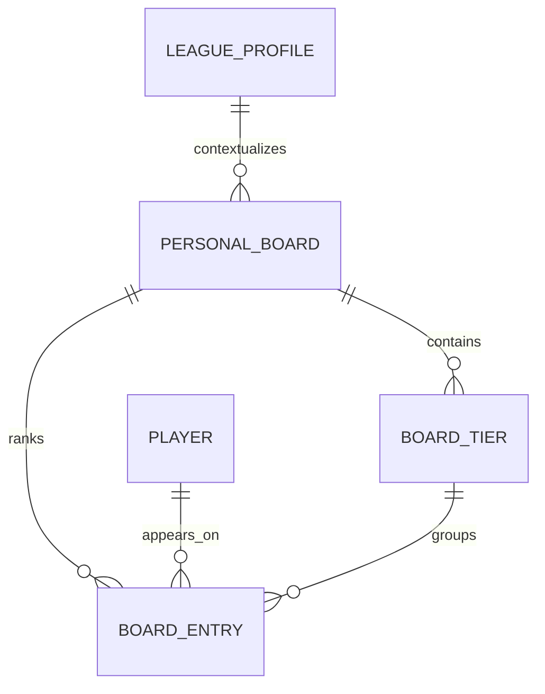

# Phase 2A Specification: Personal Board Foundation

**Status:** Approved for implementation

**Date:** 2026-07-26

## Outcome

Phase 2A turns the canonical player universe into a personal scouting board.
The user can create format-specific boards, place players into tiers, write
notes, mark favorites, and set an explicit order that remains authoritative.

This is the draft room's master board. Future Gut ELO comparisons may suggest
an order, but they cannot silently replace the user's board.

## Scope

### Included

- multiple personal boards;
- optional association with a local league profile;
- overall, rookie, and veteran board scopes;
- board name and description;
- ordered, color-labeled tiers;
- one board entry per canonical player;
- manual player order;
- player notes and favorites;
- reversible remove and re-add behavior;
- human-readable CSV export;
- transactional writes; and
- canonical player IDs on every entry and export row.

### Excluded

- Gut ELO ratings, comparison queues, or convergence;
- ADP, projections, market values, or recommendations;
- automatic ordering;
- board sharing or cloud synchronization;
- draft-state availability;
- player-plus-pick trade values; and
- direct provider IDs in board responses or exports.

## Product Rules

1. Manual board order is authoritative.
2. A board references canonical internal player IDs, never a name or provider
   ID as identity.
3. The same player appears at most once on one board.
4. Adding an existing active entry is idempotent.
5. Removing a player archives the entry instead of destroying notes, tier,
   favorite state, or history.
6. Re-adding an archived player restores the saved entry and appends it to the
   end of the active board.
7. Reordering requires the complete active player list exactly once and commits
   atomically.
8. A tier can be removed without removing its players; affected entries become
   unassigned.
9. Board and entry writes update local timestamps and survive restart.
10. Gut ELO data, when added later, will live beside manual order rather than
    replacing it.

## Data Model

### `personal_board`

- `id`: UUID string, primary key;
- `name`: user-facing name;
- `description`: optional user-authored context;
- `league_profile_id`: nullable local league-profile reference;
- `scope`: `overall`, `rookie`, or `veteran`;
- `archived`: boolean, reversible;
- `created_at` and `updated_at`: UTC timestamps.

### `board_tier`

- `id`: UUID string, primary key;
- `board_id`: personal-board reference;
- `name`: user-facing tier name;
- `color`: optional short CSS color token;
- `tier_order`: non-negative integer;
- `created_at` and `updated_at`: UTC timestamps; and
- unique tier name within a board, case-insensitive in service validation.

### `board_entry`

- `id`: UUID string, primary key;
- `board_id`: personal-board reference;
- `player_id`: canonical player reference;
- `tier_id`: nullable tier reference;
- `manual_order`: positive integer;
- `note`: optional user-authored scouting note;
- `favorite`: boolean;
- `active`: boolean for reversible removal;
- `created_at` and `updated_at`: UTC timestamps; and
- unique constraint on `(board_id, player_id)`.

Archived entries do not appear in normal board reads or exports. Their saved
presentation data remains available if the same player is re-added.

## API Contract

### Boards

- `GET /api/v1/boards`
  - `include_archived=false` by default;
  - returns summaries and active-entry counts.
- `POST /api/v1/boards`
  - creates an empty board.
- `GET /api/v1/boards/{board_id}`
  - returns board metadata, ordered tiers, and active entries with canonical
    player presentation.
- `PATCH /api/v1/boards/{board_id}`
  - updates name, description, league context, scope, or archive state.
- `GET /api/v1/boards/{board_id}/export.csv`
  - returns the current active board in manual order.

### Tiers

- `POST /api/v1/boards/{board_id}/tiers`
- `PATCH /api/v1/boards/{board_id}/tiers/{tier_id}`
- `DELETE /api/v1/boards/{board_id}/tiers/{tier_id}`
  - unassigns entries before removing the tier.

### Entries

- `POST /api/v1/boards/{board_id}/entries`
  - adds a canonical player or restores its archived entry.
- `PATCH /api/v1/boards/{board_id}/entries/{entry_id}`
  - updates tier, note, or favorite state.
- `DELETE /api/v1/boards/{board_id}/entries/{entry_id}`
  - archives the entry and compacts active order.
- `PUT /api/v1/boards/{board_id}/order`
  - accepts the complete ordered list of active canonical player IDs.

All state-changing requests use the existing local request guard.

## CSV Export

The UTF-8 CSV contains:

- `board_id`
- `board_name`
- `rank`
- `canonical_player_id`
- `name`
- `position`
- `team`
- `tier`
- `favorite`
- `note`

Provider IDs and private league identifiers are not exported.

## Error and Recovery Rules

- Missing boards, tiers, entries, or players return a safe `404`.
- A tier from another board is rejected.
- Duplicate, missing, or incomplete reorder lists return `409` and leave the
  saved order unchanged.
- Database failures roll back the entire write.
- Removing and re-adding a player is reversible without reconstructing notes.
- Archiving a board preserves all tiers and entries.

## Non-Functional Requirements

- Board reads are deterministic: manual order, then canonical player ID.
- A 500-player reorder commits in one local transaction.
- Notes are capped at 5,000 characters.
- Normal API errors and logs never include note contents.
- All schema changes use a forward-only Alembic migration.
- The board works fully offline after players exist locally.

## Acceptance Tests

1. A board can be created and survives application restart.
2. A canonical player can be added once; repeating the add does not duplicate
   the entry.
3. Two boards can rank the same player independently.
4. Manual order persists and is returned deterministically.
5. Reorder rejects incomplete, duplicate, or foreign player IDs atomically.
6. Tier assignment, note, and favorite changes persist.
7. Removing a tier unassigns entries without removing them.
8. Removing and re-adding a player restores its note, tier when still valid,
   and favorite state.
9. Archiving and restoring a board is reversible.
10. Missing canonical players cannot be added.
11. CSV export follows manual order and contains canonical IDs.
12. Provider IDs, real league IDs, and note contents are absent from normal
    errors and logs.
13. Existing Phase 0 and Phase 1 behavior remains unchanged.

## Trade-offs and Later Revisit

- A full-list reorder payload is intentionally simple and safe for a local
  board. Fractional ordering should be reconsidered only if measured drag/drop
  performance requires it.
- Archived entries preserve user work at the cost of retaining a small amount
  of inactive data.
- Boards may reference a league profile, but their player evaluations remain
  portable and are not owned by that profile.
- Gut ELO, comparison history, import, and board UI are separate task branches
  built on this contract.
