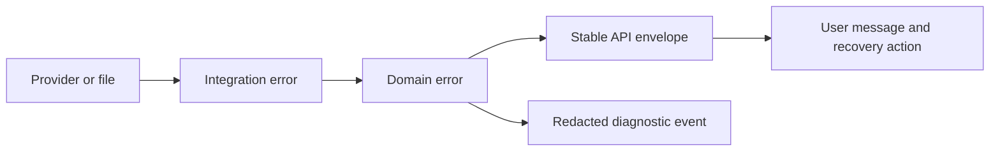

# Errors and Logging Standard

**Status:** Accepted for V1

**Date:** 2026-07-24

## Goals

When something fails, the Hub should:

1. protect saved work;
2. tell the user what happened in plain language;
3. explain what the user can do next;
4. record enough safe technical context to diagnose the problem; and
5. never disguise stale or partial data as a successful refresh.

An error message is part of the product experience, not a developer afterthought.

## Error Layers



Each layer adds context appropriate to its responsibility. It must not expose a
raw stack trace or provider payload to the layer above it.

## API Error Envelope

Every API failure uses the schema in
`docs/schemas/api-error.schema.json`.

Example:

```json
{
  "error": {
    "code": "IMPORT.SLEEPER.UNAVAILABLE",
    "message": "Sleeper could not be reached.",
    "action": "Your saved data is unchanged. Check your connection and try again.",
    "severity": "error",
    "retryable": true,
    "correlation_id": "00000000-0000-4000-8000-000000000000"
  }
}
```

Rules:

- `code` is stable and intended for application logic and support.
- `message` describes what happened without blame or jargon.
- `action` states the safest useful next step.
- `severity` controls presentation, not HTTP status.
- `retryable` means repeating the same operation may reasonably succeed.
- `correlation_id` connects the visible error to safe diagnostic logs.
- Validation errors may include field paths, but never echo secret values.

## Error Code Naming

Codes use uppercase dot-separated segments:

```text
CATEGORY.COMPONENT.CONDITION
```

Initial categories:

- `CONFIG`
- `STORAGE`
- `IMPORT`
- `VALIDATION`
- `DRAFT`
- `BACKUP`
- `EXPORT`
- `SECURITY`
- `INTERNAL`

Examples:

- `CONFIG.ACTIVE_LEAGUE.NOT_FOUND`
- `STORAGE.DATABASE.LOCKED`
- `IMPORT.SLEEPER.UNAVAILABLE`
- `IMPORT.SLEEPER.RULE_REVIEW_REQUIRED`
- `VALIDATION.LEAGUE_PROFILE.INVALID`
- `DRAFT.STATE.VERSION_CONFLICT`
- `BACKUP.WRITE.INSUFFICIENT_SPACE`
- `INTERNAL.UNEXPECTED`

Specific codes are preferred over parsing message text.

## HTTP Status Mapping

| Status | Use |
|---:|---|
| 400 | Malformed or logically impossible request |
| 403 | A local write request is missing the Hub's trust guard |
| 404 | Requested local record does not exist |
| 409 | Version conflict or operation conflicts with current state |
| 422 | Field or domain validation failed |
| 429 | The Hub itself is temporarily limiting repeated work |
| 503 | Required external source is temporarily unavailable |
| 507 | Local storage cannot safely complete the write |
| 500 | Unexpected internal failure |

An upstream provider rate limit is normally translated to `503` with a
retryable error and a suggested wait. The user is interacting with the Hub,
not directly with the provider.

## User Presentation

### Inline

Use beside a field or section when the user can correct the problem without
leaving the current task.

### Notice or toast

Use for non-blocking results such as a failed refresh when saved offline data
remains usable. Notices must remain long enough to read and be keyboard
accessible.

### Blocking recovery screen

Use only when the current workflow cannot continue safely, such as a failed
database migration. It must explain:

- what is safe;
- what is unavailable;
- the recommended recovery action; and
- where to find a correlation ID.

### Stale data

Staleness is a visible status, not an exception. A failed refresh preserves the
last successful data, its timestamp, and a warning that newer information may
be missing.

## Retry Rules

Automatic retries are limited to idempotent external reads.

- maximum two automatic retries after the initial attempt;
- exponential backoff with jitter;
- honor `Retry-After` when supplied;
- never retry authentication, validation, or mapping failures automatically;
- never hide repeated failures behind an endless loading state; and
- allow cancellation when an external read takes longer than expected.

Local state-changing operations execute once inside a transaction. On failure,
the transaction rolls back and the UI receives a definite result.

## Logging Format

Production logs use newline-delimited JSON in:

```text
%LOCALAPPDATA%\FriendlyNeighborhoodFantasyHub\logs\hub.log.jsonl
```

Each event may include:

- UTC timestamp;
- level;
- stable event name;
- component;
- correlation ID;
- duration in milliseconds;
- safe error code;
- application and database-schema versions; and
- explicitly approved, non-sensitive context.

Development consoles may use a more readable format, but the event names and
safe fields remain the same.

## Log Levels

- `DEBUG`: development-only diagnostic detail.
- `INFO`: startup, shutdown, successful migrations, backups, and refreshes.
- `WARNING`: recoverable degradation, stale data, or partial import.
- `ERROR`: an operation failed but the process can continue safely.
- `CRITICAL`: application state or startup cannot be trusted.

Routine user actions are not logged individually unless they mark an important
lifecycle event. Draft undo history and other reversible product actions belong
in durable database records, not diagnostic logs.

## Rotation and Retention

- Rotate at 5 MiB.
- Keep five completed log files.
- Never upload logs automatically.
- A future diagnostic bundle must show a file preview and require explicit user
  confirmation before export.

## Privacy Rules

Normal logs must not include:

- API keys, tokens, cookies, or authorization headers;
- email addresses or phone numbers;
- provider account, league, draft, roster, or member identifiers;
- raw provider payloads;
- league chat;
- personal notes, rankings, or board contents;
- local filesystem paths containing a Windows username; or
- database rows or SQL parameters containing user data.

Logging uses an allowlist of safe fields rather than trying to redact arbitrary
objects after the fact. Exception messages from external libraries are reviewed
and normalized before logging.

Player names and public football data may appear only when necessary for a
specific development diagnostic. They are omitted from normal production logs.

## Correlation IDs

Every incoming API request receives a UUID correlation ID. The backend returns
it in:

- the error envelope for failed requests; and
- an `X-Correlation-ID` response header.

The frontend displays the ID only when it helps diagnose a failure. It should
be copyable without exposing the underlying log.

## Crash and Boundary Handling

- FastAPI has a final exception handler that rolls back active work, records
  `INTERNAL.UNEXPECTED`, and returns the standard envelope.
- React has a top-level error boundary with a safe reload option.
- Feature-level boundaries are added around draft-night surfaces where one
  panel should not take down the entire room.
- Database migration failure stops startup before the application accepts
  writes.
- The most recent verified backup remains untouched during recovery attempts.

## Required Tests

Phase 0 tests will verify:

- every API error matches the JSON Schema;
- unexpected exceptions do not expose stack traces in responses;
- correlation IDs appear in responses and logs;
- sensitive sample values are absent from captured logs;
- failed configuration writes roll back;
- a failed external refresh preserves prior data and timestamp;
- retry limits are honored; and
- the frontend renders inline, non-blocking, and blocking errors accessibly.

## Revisit Later

- User-controlled log retention after real-world disk usage is observed.
- Operating-system event logging during desktop packaging.
- Opt-in encrypted support bundles if remote support becomes necessary.
- Performance tracing only when measured latency requires it.
